# Analyzing stocks for investment

## Overview
A financier is interested in analizing stocks to recommend his clients where they should invest their money.
A dataset was provided with information from twelve different companies in order to analyze their stocks behaviour through different years.
Since the clients are insterested to invest in green energy companies they think that DAQO New Energy Corp (DQ), is the best choice but before they invest, the financier needs to support this decision with data.

The dataset contians information such as Ticker, Date, Open ,High, Low, Close, Adj Close and Volumen.

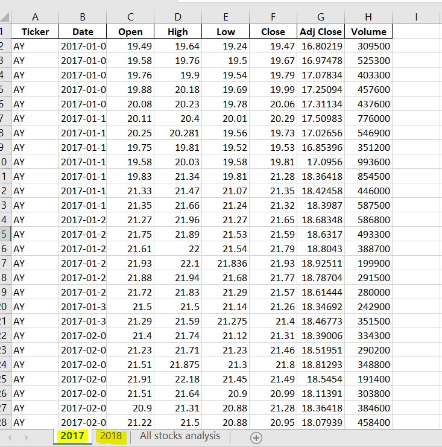

A program in VBA is required to analize the dataset. 
Three things need to be accomplished:

* Show the time that it takes to make the calculations
* Calculate the Daily Volume which is the total number of shares traded throughout the day, it measures how actively a stock is traded and calculate the Yearly Return which is the percentage difference in price from the beginning of the year to the end of the year.
* Format the results in a readable table.

First we set the variables and the format where the results will be shown.
The program has to be able to analize any year that we require, therefore a variable to ask for the year of interest is created using an inputbox. We initialize the timer and activate the worksheet where we will set the format.

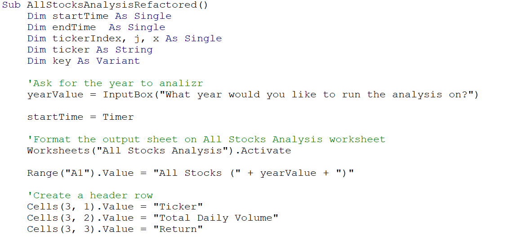

It's required to know the number of the last row with data, to get this information we use the .count property for rows that provides the total amount of rows in the range, then we apply the .end(xlUP) property that indicates VBA to move from the final row in the sheet (1,048,576) up to the first row with data, that results to be the last row in the dataset and finally the .row property is applied to return the number of the first row of the first area in the range. We have to make sure to activate the worksheet where the code will count the amount of rows. 

The program has to be able to analize a random number of tickers, therefore a dictionary was implemented to add unique values of tickers to it.
A for loop is implemented to iterate through each row of the data and add values of tickers in the dictionary, the method .exists returns True if a specified key exists in the dictionary and pass to the next iteration, but if it returns False we proceed to add the value. Dictionaries add key,item values and therefore a "j" variable was declared to use it as the item.
Finally we calculate the amount of unique values with the .count property to determine the number of items in the dictionary.
The code is shown below.

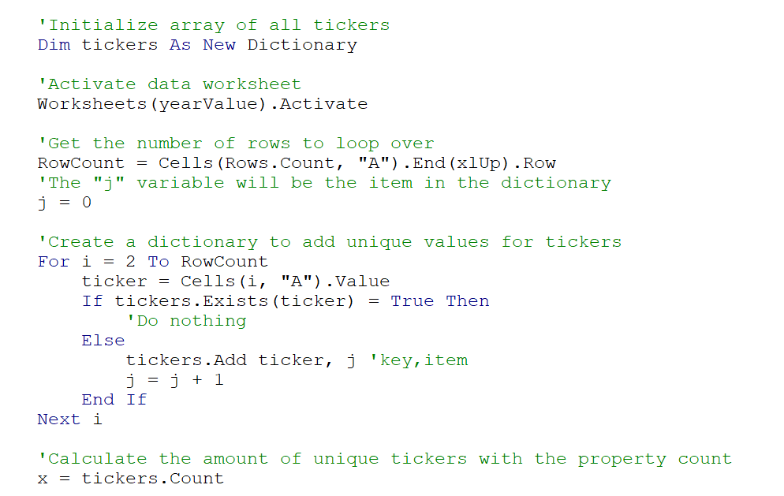

Three arrays are created to store the results for the Total Daily Volume, Starting Price and Ending Price. To store data in these arrays, we create an index to iterate through them. We make sure to activate the worksheet where we'll be analyzing the data.

Two nested for loops are used, the first for loop interates from 0 to (x-1) which is the dimension of the arrays created. Below this for loop we initialize the array for Total Daily Volume with 0 because when the code finish to iterate through all the rows (second for loop) for the currect ticker in the tickerIndex position, the next ticker in the position tickerIndex + 1 will have it's Total Daily Volume at 0. As mentioned before, the second for loop iterate through all the rows of data and compare the actual cell with the current ticker in the dictionary, if the condition it's True it proceed to add the Volume. To select the start and ending price, the conditions are shown below. 
This procedure will continue until the index reach the dimension of the arrays (x-1).

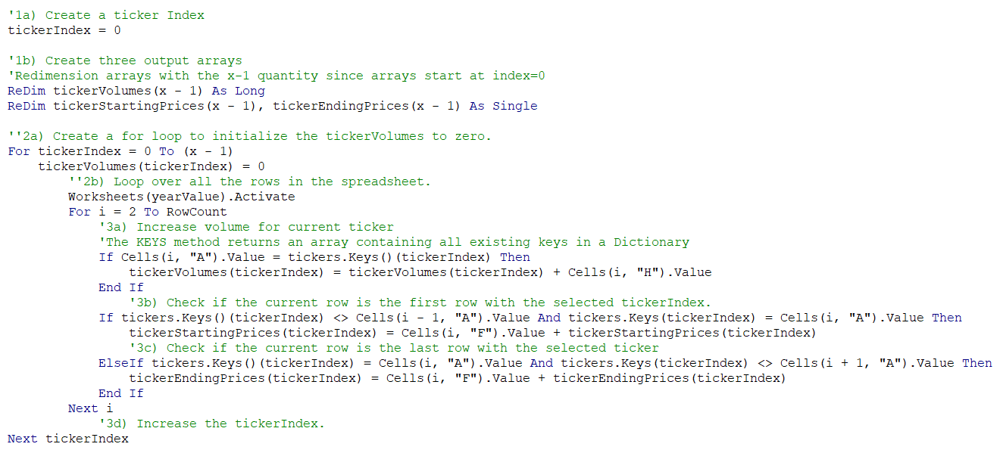

We proceed to show the results in the "All stocks analysis" sheet. The table starts at row 4, so we make sure that the results starting printing in the right cells.
To show the results stored in the arrays, another for loop is implemented to iterate through each key in the dictionary and then the index "i" is increased at each iteration for the other arrays. Also the code to format the results in colors is used, using the condition for values greater than 0 set it green and less than 0 set it to red. To calculate the Yearly Return we subtract the (ending_price-starting_price)/starting_price as shown below.

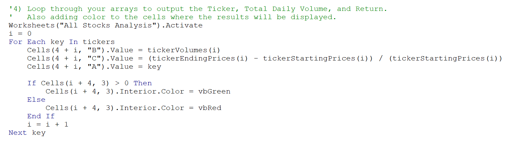

Finally we set the final formatting to the table where the results will be printed, we finish the timer and show in a message box the total time that took to run the code.

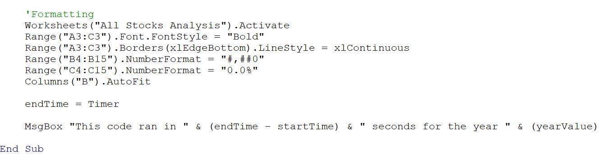

## Results

###  The results of the analysis for 2017 and 2018 with the refactored VBA code are:

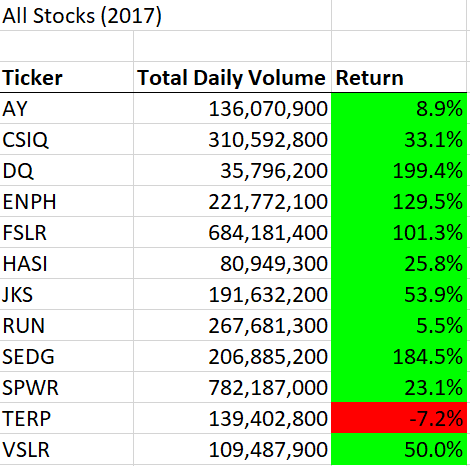

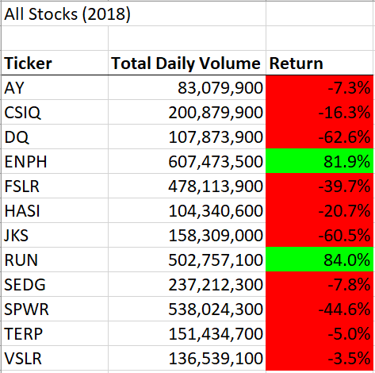

------------------------------------------------------------------------------------------

###  The time results with the refactored VBA code are:

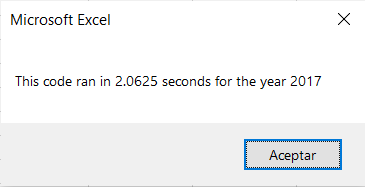

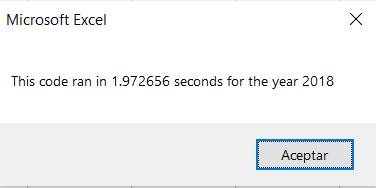

------------------------------------------------------------------------------------------

###  The time results with the original VBA code are:

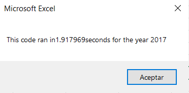

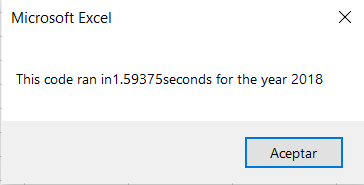

------------------------------------------------------------------------------------------

As we can see in the previous images, the time from the original code is less than the time from refactored code.
A reason for this could be that in the original code we established the values for the tickers array, while in the refactored code a for loop was implemented to add unique values to the dictionary. This means that we loop through the whole dataset twice and therefore the time increases.

Although the time of the refactored code it's greater than the original code it has a great advantage, and it's that it works for any quantity of tickers, while the original code only works for the quantity tickers declared.

## Summary

* An advantage of refactoring a code is that the purpose of the code is stablished and you can start from there to improve and make it more efficient and also, refactoring codes demonstrate that there are different paths to solve a problem and it allows you to learn another ways of programming.

* A disadvantage could be that if the code is not readable or not well commented, you can struggle to understand why it's structured the way it is. This could be time consuming and stressing.

* In conclusion, refactoring code is a common practice in the programming world and, as a Data Analyst you have to be prepared to work with existing codes in order to improve them. In this case of "Analyzing stocks" the refactored code runs a bit slower than the original but it's more robust.

